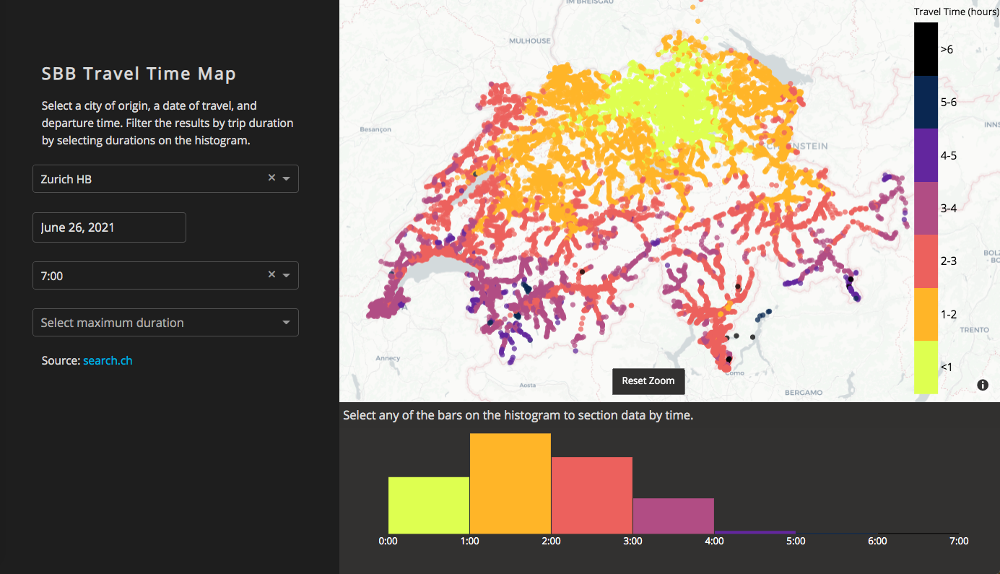

# SBB Time Map
> Creates a map of SBB train/bus stations colorcoded by travel time from a given city.

[![python version][python-image]][python-url]
<!-- ([![Build Status][travis-image]][travis-url]) 
[![Downloads Stats][npm-downloads]][npm-url]-->

This program queries the SBB's API to gather information on journey times from a starting origin to the rest of the
country. Given an origin city, starting time, and day of the month, a map is built showing how long it takes to get 
to each other station.

Click anywhere on the image to view the interactive map.

SBB gives each user 1000 free API requests per day, but there are ~30,000 destinations in the network. The original 
version of this project cleverly determined which stations were end nodes and queried only these, getting data for each
intermediate station along the way. There were still about 1500 end nodes, and each query took 0.2 to 10 seconds - no bueno.

Thankfully, a website called search.ch has a much better API: still with the 1000 free requests per day, but now with 
multiple destination queries. Now, in 15 API calls, the full ~30,000 destination data are at our disposal. Each API get
takes about 10 seconds, which is out of my hands, but the code does query it asynchronously, allowing for parallel requests.

As of writing, this is a workable web app using Dash/Flask, but hosting it on Heroku is harder than I expected. So for
now, it must remain a static html file 

Next steps:
- Get it running on Heroku!
- Clean up this git.
- Create a way for users to input their own starting city/time/date and add that data to the database. Currently too slow
for such a feature, but perhaps a "submit this and check back later" feature.
- Make sure it works for mobile.
- Get the histogram to be a litle more exciting.

<!-- Markdown link & img dfn's -->
[python-image]: https://img.shields.io/badge/python-3.6-blue.svg
[python-url]: https://www.python.org/downloads/release/python-360/
[npm-downloads]: https://img.shields.io/npm/dm/datadog-metrics.svg?style=flat-square
[travis-image]: https://img.shields.io/travis/dbader/node-datadog-metrics/master.svg?style=flat-square
[travis-url]: https://travis-ci.org/dbader/node-datadog-metrics
[wiki]: https://github.com/yourname/yourproject/wiki
